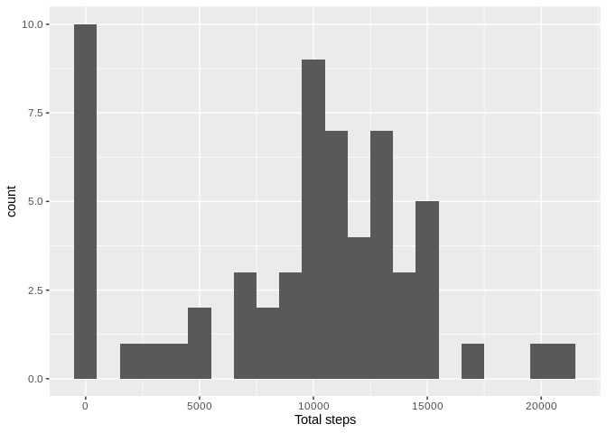
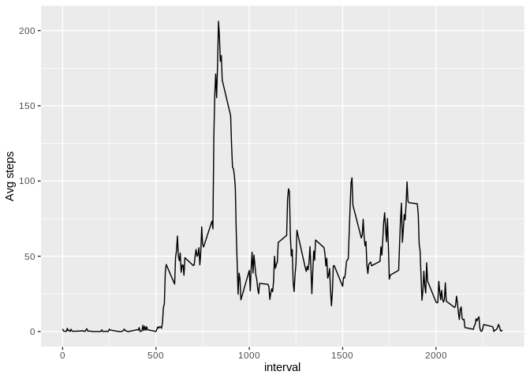
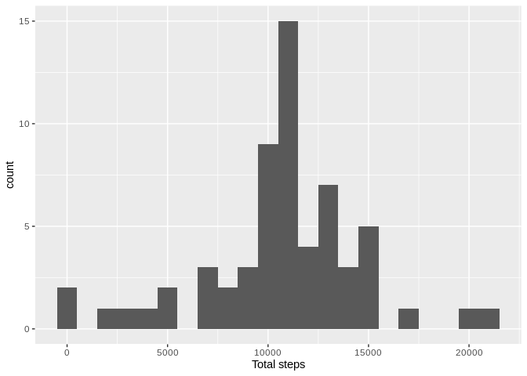
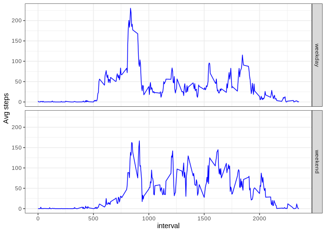

## Loading and preprocessing the data

All data is loaded in a variable called `df`


```r
df <- read.csv(unz("activity.zip", "activity.csv"), stringsAsFactors = FALSE)
df$date <- as.Date(df$date, "%Y-%m-%d")
```


## What is mean total number of steps taken per day?

The total number of steps per day is calculated above


```r
library(dplyr)
```

```
## 
## Attaching package: 'dplyr'
```

```
## The following objects are masked from 'package:stats':
## 
##     filter, lag
```

```
## The following objects are masked from 'package:base':
## 
##     intersect, setdiff, setequal, union
```

```r
stepsByDay <- group_by(df, date)
stepsDaySummary <- summarize(stepsByDay, totalSteps = sum(steps, na.rm = TRUE))
stepsDaySummary
```

```
## # A tibble: 61 x 2
##    date       totalSteps
##    <date>          <int>
##  1 2012-10-01          0
##  2 2012-10-02        126
##  3 2012-10-03      11352
##  4 2012-10-04      12116
##  5 2012-10-05      13294
##  6 2012-10-06      15420
##  7 2012-10-07      11015
##  8 2012-10-08          0
##  9 2012-10-09      12811
## 10 2012-10-10       9900
## # … with 51 more rows
```

The histogram of the total number of steps taken each day


```r
library(ggplot2)
ggplot(stepsDaySummary, aes(x=totalSteps)) + geom_histogram(binwidth = 1000) + xlab("Total steps")
```

<!-- -->

The mean and median of steps per day are calculated above


```r
mean(stepsDaySummary$totalSteps)
```

```
## [1] 9354.23
```

```r
median(stepsDaySummary$totalSteps)
```

```
## [1] 10395
```

## What is the average daily activity pattern?

Time series plot of the 5-minute interval (x-axis) and the average number of steps taken, averaged across all days (y-axis)


```r
stepsByInterval <- group_by(df, interval)
stepsIntervalSummary <- summarize(stepsByInterval, averageSteps = mean(steps, na.rm = TRUE))
ggplot(stepsIntervalSummary, aes(x=interval, y=averageSteps)) + geom_line() +ylab("Avg steps")
```

<!-- -->

The 5-minute interval, on average across all the days in the dataset, contains the maximum number of steps is shown above


```r
filter(stepsIntervalSummary, averageSteps >= max(stepsIntervalSummary$averageSteps))
```

```
## # A tibble: 1 x 2
##   interval averageSteps
##      <int>        <dbl>
## 1      835         206.
```

## Imputing missing values

Total number of missing values in the dataset


```r
sum(is.na(df$steps))
```

```
## [1] 2304
```

To impute the missing values I opted to take the mean for the interval. Creating a new dataset (`newdf`) that is equal to the original dataset but with the missing data filled in.


```r
newdf <- merge(df, stepsIntervalSummary, by = "interval")
newdf <- mutate(newdf, steps = ifelse(is.na(steps), averageSteps, steps))
newdf <- select(newdf, names(df))
```

The histogram of the total number of steps taken each day after imputing missing data


```r
stepsByDay <- group_by(newdf, date)
stepsDaySummary <- summarize(stepsByDay, totalSteps = sum(steps))
ggplot(stepsDaySummary, aes(x=totalSteps)) + geom_histogram(binwidth = 1000) + xlab("Total steps")
```

<!-- -->

The mean (`{r}mean(stepsDaySummary$totalSteps)`) and median (`{r}median(stepsDaySummary$totalSteps)`) of steps per day after imputing missing data are calculated above


```r
mean(stepsDaySummary$totalSteps)
```

```
## [1] 10766.19
```

```r
median(stepsDaySummary$totalSteps)
```

```
## [1] 10766.19
```

As it can be seen, after imputing the missing data, the mean of average steps by day are a lot higher. And due to the chosen strategy to impute data, the mean and the median are now equals.

## Are there differences in activity patterns between weekdays and weekends?

Create a new factor variable in the dataset with two levels – “weekday” and “weekend” indicating whether a given date is a weekday or weekend day.


```r
newdf2 <- mutate(newdf, daytype = ifelse((weekdays(date) %in% c("Saturday","Sunday")), "weekend", "weekday"))
stepsByInterval2 <- group_by(newdf2, interval, daytype)
stepsByInterval2Summary <- summarize(stepsByInterval2, averageSteps = mean(steps))
ggplot(stepsByInterval2Summary, aes(x=interval, y=averageSteps)) + geom_line(colour="blue") + ylab("Avg steps") + facet_grid(daytype ~ .) + theme_bw()
```

<!-- -->

It seems that users are a lot more actives on weekdays than on weekends.
